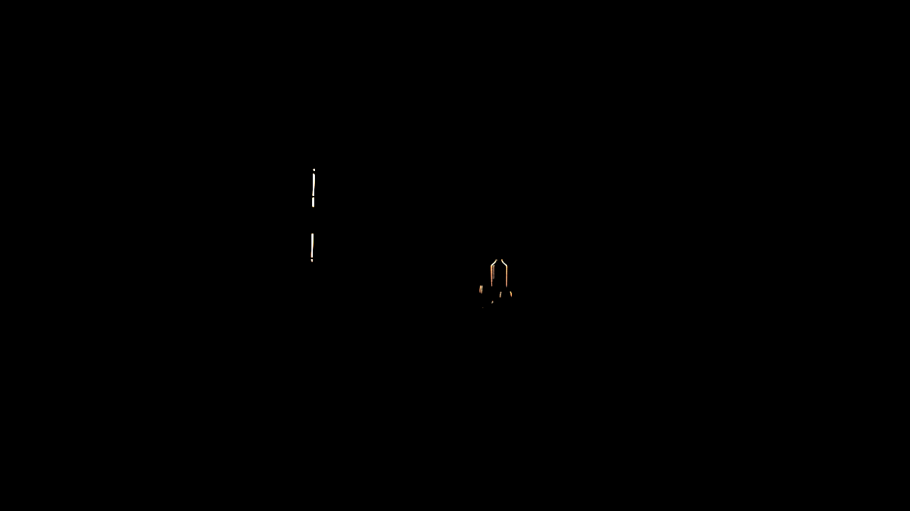

<!-- ABOUT THE PROJECT -->
## About The Project

A light path expression (LPE) is a type of regular expression that describes a specific light path (or set of paths) based on the scattering events. LPEs can be used to extract specific light contributions from the rendering algo- rithm. In this project, we aim to support LPEs in Mitsuba3. This is achieved through transferring regular expression to nondeterministic finite automa- ton(NFA) using the Thompson construction algorithm and simplifying it to deterministic finite automaton(DFA), constructing an interface on top of Dr.Jit to realize batch transition, and crafting LPE integrator. Our code integrates seamlessly with Mitsuba’s existing path tracers by adding only a few lines of code. In thorough validation experiments, we show that this project produces accurate results. Our implementation may also help with other applications such as differentiable rendering, etc.

<!-- GETTING STARTED -->
## Getting Started

To run the project, [Mitsuba3](https://mitsuba.readthedocs.io/en/stable/) and [Dr.Jit](https://github.com/mitsuba-renderer/drjit) are required. The following command will also install Dr.Jit on your system if not already available.

  ```
 pip install mitsuba
  ```

## Structure of the project

```
├── Integrator
│   ├── direct_flag.py
│   ├── direct_LPE.py
│   ├── direct_mis.py
│   ├── direct.py
│   ├── path_mats_LPE.py
│   ├── path_mats.py
│   ├── path_mis_LPE.py
│   ├── path_mis.py
│   ├── test_direct.py
│   ├── test_mats.py
│   └── test_mis.py
│
├── LPE_Engine
│   ├── __init__.py
│   ├── drjit_utils
│   |   ├── __init__.py
│   |   └── drjit_dfa.py
│   └── prototype
│       ├── __init__.py
│       ├── dfa.py
│       ├── lexical_analysis.py
│       ├── nfa.py
│       └── parse.py
│
├── test_LPE
│   ├── test_dfa.py
│   ├── test_drjit_dfa.py
│   ├── test_LPE_NFA.py
│   └── test_multimask.py
│
├── testing_scene
│   ├── kitchen
│   ├── living-room
│   └── staitcase2
|
└── README.md
```

- `Integrator`: This folder contains various integrators writing in python and LPE integrator testing script. Files whoes name ends with `_LPE` are LPE integrators. `test_direct.py` tests the LPE direct mats integrator. `test_mats.py` test the LPE mats path tracer. `test_mis.py` tests the LPE mis path tracer.
- `LPE_Engine`: This folder contains the code for covnerting regular expression to DFA (in `prototype`) and LPE Mitsuba interface(in `drjit_utils`). One of the core function in this project `transition()` is defined in `LPE_Engine/drjit_utils/drjit_dfa.py`.
- `test_LPE`: This folder contains test scripts for LPE engine.
- `testing_scene`: This folder contains the scenes used for functionality demonstration in the final report. By running the `run.py` in each scene's folder, people can get the same images shown in the final report.

## Usage

There are two ways to use the LPE integrator in XML script. The first is to specify the LPE directly, which will produce an image filtered by the given LPE.

~~~python
inegrator0 = mi.load_dict( {
'type': 'pmisLPE', 
'lpe': 'ST.*E', 
'max_depth': 65,
})
~~~

The second is to specify the LPE and set the complement flag to true, which will generate an image of the complement of the LPE.

~~~python
inegrator0 = mi.load_dict( {
'type': 'pmisLPE', 
'lpe':'ST.*E', 
'complement':True, 
'max_depth': 65,
})
~~~

## Gallery

### Modern Hall

Different layers of ’Modern Hall’ by <a href=" https://benedikt-bitterli.me/resources/">NewSee2l035</a>, generated using the light path expression (LPE) module developed in this project. This scene, which features fine details and a variety of materials, is rendered with a maximum depth of 65 and a sample count of 512.

<table border="1">
        <tr>
            <td><p>Original Image</p></td>
            <td><p>Direct Diffuse</p></td>
            <td><p>Indirect Diffuse</p></td>
        </tr>
        <tr>
            <td><p>Glossy</p></td>
            <td><p>Direct Specular</p></td>
            <td><p>Indirect Specular</p></td>
        </tr>
        <tr>
            <td><p>Emissive</p></td>
            <td><p>Transmissive</p></td>
            <td><p>Complement of transmissive</p></td>
        </tr>
</table>

### Country Kitchen

Different layers of ’Country Kitchen’ by <a href=" https://benedikt-bitterli.me/resources/">Jay-Artist</a>, filtered by the LPE module developed in this project. Images are rendered with a maximum depth of 65 and a sample count of 512.

<table border="1">
        <tr>
            <td><p>Original Image</p></td>
            <td><p>Direct Diffuse</p></td>
            <td><p>Indirect Diffuse</p></td>
        </tr>
        <tr>
            <td><p>Glossy</p></td>
            <td><p>Direct Specular</p></td>
            <td><p>Indirect Specular</p></td>
        </tr>
        <tr>
            <td><p>Emissive</p></td>
            <td><p>Transmissive</p></td>
        </tr>
</table>

### Living room

Different layers of ’Grey & White Room’ by <a href=" https://benedikt-bitterli.me/resources/">Wig42</a>, filtered by the LPE module developed in this project. Images are rendered with a maximum depth of 65 and a sample count of 512.

<table border="1">
        <tr>
            <td><p>Original Image</p></td>
            <td><p>Direct Diffuse</p></td>
            <td><p>Indirect Diffuse</p></td>
        </tr>
        <tr>
            <td><p>Glossy</p></td>
            <td><p>Direct Specular</p></td>
            <td><p>Indirect Specular</p></td>
        </tr>
        <tr>
            <td><p>Emissive</p></td>
            <td><p>Transmissive</p></td>
        </tr>
</table>

<!-- MARKDOWN LINKS & IMAGES -->
<!-- https://www.markdownguide.org/basic-syntax/#reference-style-links -->